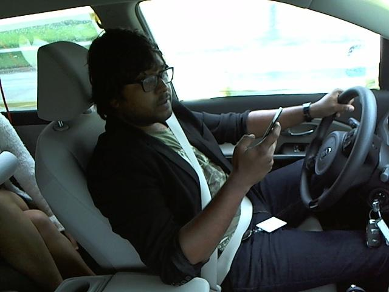

# Distracted Driver Detection

## Applying on Input Video

## Applying on Input Image

## Project Overview
There has been a substantial increase in the total number of road accidents leading to fatal injuries and deaths in recent years. As per the Union Road Transport and Highways Ministry Report 2016, 17 people were killed each hour in India due to road accidents. A major reason behind these staggering figures are distracted drivers. In this project, I aim to develop a model which will identify whether a driver is distracted or not. I will use various Deep Learning models, namely the Convolution Neural Network(CNN), VGG16 to create my model. For the purpose of training and testing, I have used the kaggle dataset provided by State Farm which contains images of drivers in different scenarios, and we will try to classify them into various classes. Some important libraries used in creation of this model are scikit-learn and keras.

## Problem Statement

Given a dataset of 2D dashboard camera images, an algorithm needs to be
developed  to classify each driver's behaviour and determine if they are
driving attentively, wearing their seatbelt, or taking a selfie with their friends in
the backseat etc..? This can then be used to automatically detect drivers
engaging in distracted behaviours from dashboard cameras.

Following are needed tasks for the development of the algorithm:

1. Download and preprocess the driver images

2. Build and train the model to classify the driver images

3. Test the model and further improve the model using different techniques.

## Data Exploration

The provided data set has driver images, each taken in a car with a driver
doing something in the car (texting, eating, talking on the phone, makeup,
reaching behind, etc). This dataset is obtained from Kaggle(State Farm
Distracted Driver Detection competition).

Following are the file descriptions and URL’s from which the data can be
obtained :
* imgs.zip - zipped folder of all (train/test) images
* sample_submission.csv - a sample submission file in the correct format
* driver_imgs_list.csv - a list of training images, their subject (driver) id, and
* class id
* driver_imgs_list.csv.zip
* sample_submission.csv.zip

The 10 classes to predict are:

* c0: safe driving

* c1: texting - right

* c2: talking on the phone - right

* c3: texting - left

* c4: talking on the phone - left

* c5: operating the radio

* c6: drinking

* c7: reaching behind

* c8: hair and makeup

* c9: talking to passenger

There are 102150 total images. Of these 17939 are training images,4485
are validation images and 79726 are training images. All the training,
validation images belong to the 10 categories shown above.
The images are
coloured and have 640 x 480 pixels each as shown below  

Driver texting right  
  

Driver operating the radio  

